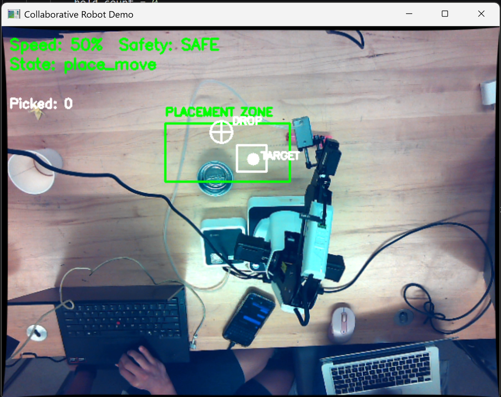
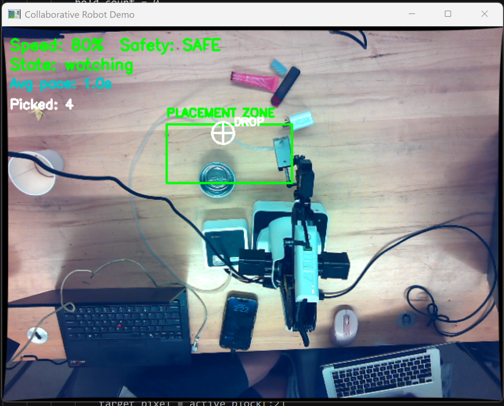
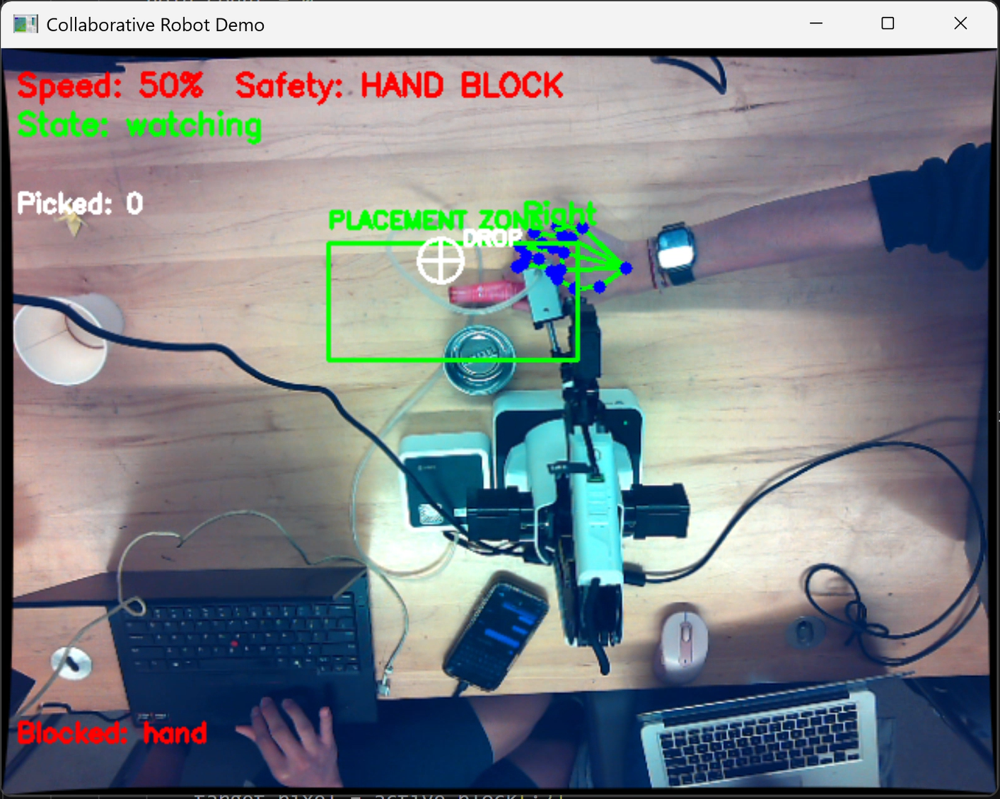

# Collaborative Robotic Arm

Camera-guided collaborative robot demo for the Toyota Manufacturing Company Canada Innovation Challenge 2026.

This project turns a Dobot Magician robotic arm into a human-aware pick-and-place partner. Instead of putting the robot in a cage and keeping people away from it, the system watches a shared workspace with an overhead camera, waits for a human to place an object, checks that the human's hand is clear, then picks the object and moves it to a configured drop zone. The demo is built around the idea that future factory robots should not only automate work, but collaborate safely, predictably, and understandably with people.

## What Problem It Solves

Traditional industrial robots are powerful but isolated. They usually need fences, cages, or strict separation because they do not understand when a person is nearby. That limits how flexible a production line can be.

This project explores a safer collaborative workflow:

- A human worker can place parts into a shared placement zone.
- The robot detects when a part is ready.
- The robot pauses if a hand is detected inside the work zone.
- Once the zone is clear, the robot picks the object and drops it at the correct location.
- The camera feed shows status overlays so the human can understand what the robot sees and intends to do.
- The robot adapts its speed based on the pace of the human's work.

The result is a proof of concept for a robot that feels less like a dangerous machine and more like a teammate in a shared assembly task.

## Project Name: Kizuna

The project concept is called **Kizuna**, meaning connection or bond. That name fits the goal: the robot and human are not doing separate tasks in separate spaces. They are connected through one shared workflow.

In the demo, Kizuna watches the workspace, reacts to the human's pace, blocks movement when hands are present, and provides visual feedback through the camera/UI. The long-term idea is a manufacturing assistant that communicates clearly enough for people to trust it.

## Main Features

- **Computer vision object detection** using OpenCV.
- **Overhead camera calibration** using ArUco markers and homography mapping.
- **Pixel-to-robot coordinate conversion** so camera detections become Dobot XY coordinates.
- **Dobot Magician control** through the Dobot DLL wrapper.
- **Shared placement zone** where humans can place blocks or objects.
- **Hand safety detection** using MediaPipe hand landmarks.
- **Pace-based speed adaptation** so the robot changes speed based on how quickly the human places objects.
- **Configurable drop zones** through JSON files.
- **Live visual overlay** showing robot state, placement zone, detected target, safety status, and drop position.
- **Web UI preview** served with Flask, showing the latest camera frame and mood controls.
- **Test scripts** for camera, robot, picking, hand safety, and emotion movement experiments.

## Demo Media

These demo captures show the robot's camera view and safety behavior during the collaborative workflow.

### Safe Workspace

When the placement zone is clear, the system marks the workspace as safe and allows the robot to continue.





### Blocked Workspace

When a hand or unsafe object is detected in the active work zone, the robot blocks movement until the zone is clear.



### Demo Video

Watch the recorded demo here:

[Open demo video on Google Drive](https://drive.google.com/file/d/1AYNPdIinn_5iq9_mfDvOMakGSjcNNhBK/view?usp=drive_link)

## How It Works

The main demo is [collaborative_demo.py](collaborative_demo.py). It runs a loop that combines camera perception, safety checks, robot control, and UI export.

1. **Camera setup**
   The program opens the camera, loads [camera_params.npz](camera_params.npz), and undistorts each frame so object positions are more accurate.

2. **Workspace mapping**
   The file [HomographyMatrix.npy](HomographyMatrix.npy) maps camera pixels to robot table coordinates. This is what lets a pixel like `(260, 170)` become a real Dobot position like `(210 mm, -35 mm)`.

3. **Human places an object**
   The camera watches a rectangular placement zone. The robot only considers objects inside this zone.

4. **Safety check**
   [hand_safety.py](hand_safety.py) uses MediaPipe's hand landmarker model to detect hands. If a hand is inside the placement zone, the robot does not move.

5. **Object detection**
   The demo can detect generic objects or color-based objects. It uses HSV thresholds from [hsv_ranges.json](hsv_ranges.json), optional object templates from [object_templates](object_templates), and fixed drop destinations from [object_drop_zones.json](object_drop_zones.json).

6. **Robot pick sequence**
   The Dobot moves above the target, lowers to pick height, closes the gripper, raises to a safe travel height, moves to the drop zone, releases the object, and returns to its ready position.

7. **Feedback**
   The OpenCV window shows the robot state, safety status, target, placement zone, and drop location. The same annotated camera frame is written to [UI/latest.jpg](UI/latest.jpg) so the Flask UI can display it in a browser.

## State Machine

The main demo uses a simple state machine:

```text
watching
  -> pick_move
  -> pick_lower
  -> place_move
  -> place_drop
  -> return_xy
  -> watching
```

During `watching`, the robot waits for a stable object in the placement zone. During movement states, the Dobot command blocks until the physical movement finishes. After each object is delivered, the robot returns to the ready position and waits for the next object.

## Hardware

- Dobot Magician robotic arm
- Dobot gripper or suction tool
- Overhead USB/Orbbec camera
- Calibration board with ArUco markers
- Printed or physical workspace with a defined placement zone
- Blocks or small objects for pick-and-place testing
- Windows computer recommended because the Dobot DLL files are Windows DLLs

## Software Requirements

Recommended Python dependencies:

```bash
pip install opencv-python numpy mediapipe flask
```

The UI folder has a small requirements file:

```bash
pip install -r UI/requirements.txt
```

Important model/data files already included in this repo:

- [hand_landmarker.task](hand_landmarker.task)
- [face_landmarker.task](face_landmarker.task)
- [camera_params.npz](camera_params.npz)
- [HomographyMatrix.npy](HomographyMatrix.npy)
- [hsv_ranges.json](hsv_ranges.json)
- [object_drop_zones.json](object_drop_zones.json)

## Running the Demo

Before running the main demo, make sure:

- The Dobot is powered on and connected.
- The camera is connected and positioned above the workspace.
- The Dobot COM port in [dobotArm.py](dobotArm.py) matches your machine. The current code connects to `COM6`.
- The calibration files match the current camera/table setup.
- The robot workspace is clear.

Run the main collaborative demo:

```bash
python collaborative_demo.py
```

Controls:

- `Q` quits the demo.
- `R` resets the learned empty placement zone.
- `M` runs a manual test move to `(200, 0, 40)` and back.

## Running the Web UI

The UI is optional, but useful for presentation. It displays the latest annotated frame produced by `collaborative_demo.py`.

In one terminal, run:

```bash
python collaborative_demo.py
```

In another terminal, run:

```bash
cd UI
python app.py
```

Then open:

```text
http://localhost:5000
```

The UI reads [UI/latest.jpg](UI/latest.jpg), which is continuously updated by the main demo.

## Calibration Workflow

Good calibration is the most important part of the project. If calibration is wrong, the robot will move to the wrong physical location.

### 1. Camera Intrinsic Calibration

Use [calibrateCamera.py](calibrateCamera.py) to create or update `camera_params.npz`.

```bash
python calibrateCamera.py --calibrate
```

This uses a 4 by 4 ArUco GridBoard. Capture many steady frames from different angles, then let the script compute camera intrinsics and distortion coefficients.

Preview undistortion:

```bash
python calibrateCamera.py --preview
```

### 2. Camera-to-Robot Homography

Use [getTransformationMatrix.py](getTransformationMatrix.py) to create `HomographyMatrix.npy`.

```bash
python getTransformationMatrix.py
```

This moves the robot through known XY positions. For each position, you place a red marker where the robot tip was, and the script records the corresponding camera pixel. It then computes the homography from image pixels to robot coordinates.

Re-run this whenever the camera, table, robot base, or workspace layout changes.

## Safety

This is a student prototype and should be treated as an experimental demo, not a certified industrial safety system.

Safety features implemented:

- MediaPipe hand detection through [hand_safety.py](hand_safety.py).
- Motion blocking when a hand is detected in the placement zone.
- Robot coordinate bounds in [collaborative_demo.py](collaborative_demo.py) to reject unsafe mapped positions.
- Safe travel height `Z_SAFE` to avoid dragging the gripper across the table.
- A ready position away from the active pick area.

Safety rules for running:

- Keep one person responsible for emergency stop/power at all times.
- Start at low robot speed while testing.
- Keep hands out of the work zone while the robot is moving.
- Recalibrate after any camera or table movement.
- Test with lightweight objects first.
- Do not rely on computer vision as the only safety layer for real manufacturing use.

Additional reference photos and notes are in [Safety Instructions](Safety%20Instructions).

## Important Files

| File or folder | Purpose |
| --- | --- |
| [collaborative_demo.py](collaborative_demo.py) | Main human-aware pick-and-place demo. |
| [dobotArm.py](dobotArm.py) | Dobot connection, homing, movement, gripper, and speed helpers. |
| [hand_safety.py](hand_safety.py) | MediaPipe hand detection module and standalone hand-safety tester. |
| [mood_movement.py](mood_movement.py) | Small expressive robot motions triggered by mood names. |
| [calibrateCamera.py](calibrateCamera.py) | Camera intrinsic calibration using ArUco markers. |
| [getTransformationMatrix.py](getTransformationMatrix.py) | Builds the pixel-to-robot homography matrix. |
| [pickCVBlock.py](pickCVBlock.py) | Earlier three-phase pick/place prototype. |
| [testCamera.py](testCamera.py) | Camera listing, calibration loading, and preview test. |
| [testDobot.py](testDobot.py) | Basic Dobot connection/movement test. |
| [test_pick.py](test_pick.py) | Simplified automatic pick test near the arm. |
| [test_Emotions.py](test_Emotions.py) | MediaPipe face/emotion experiment with robot reactions. |
| [UI](UI) | Flask web UI for live camera preview and mood triggers. |
| [lib](lib) | Dobot DLL, Python wrapper, and required Windows DLL dependencies. |
| [object_templates](object_templates) | Template images for object-specific detection experiments. |
| [demo](demo) | Demo screenshots/video assets. |
| [KIZUNA_IMPLEMENTATION.md](KIZUNA_IMPLEMENTATION.md) | Planning document for the Kizuna personality/safety concept. |

## Configuration Files

- [hsv_ranges.json](hsv_ranges.json): HSV color ranges for red, green, and blue detection.
- [object_drop_zones.json](object_drop_zones.json): Fixed robot XY drop coordinates for object categories.
- [object_routes.json](object_routes.json): Optional object routing config.
- [camera_params.npz](camera_params.npz): Camera matrix and distortion coefficients.
- [HomographyMatrix.npy](HomographyMatrix.npy): Pixel-to-robot coordinate transform.

## Testing Individual Parts

Camera test:

```bash
python testCamera.py
```

Dobot test:

```bash
python testDobot.py
```

Hand safety test:

```bash
python hand_safety.py
```

Static image hand test:

```bash
python hand_safety.py --image path/to/image.jpg
```

Pick test:

```bash
python test_pick.py
```

Emotion experiment:

```bash
python test_Emotions.py
```

## Troubleshooting

**Robot does not connect**

- Check that the Dobot is powered on.
- Check the USB cable.
- Update the hardcoded `COM6` in [dobotArm.py](dobotArm.py) if your Dobot uses a different COM port.
- Make sure no other Dobot program is already connected.

**Camera does not open**

- Try a different camera index.
- On Windows, the code prefers `cv2.CAP_DSHOW`.
- Close other apps that may be using the camera.

**Robot moves to the wrong position**

- Re-run `calibrateCamera.py --calibrate`.
- Re-run `getTransformationMatrix.py`.
- Do not move the camera after calibration.
- Confirm the placement zone maps inside the safe robot workspace.

**Object detection is unreliable**

- Improve lighting.
- Use objects with stronger contrast from the table.
- Tune [hsv_ranges.json](hsv_ranges.json).
- Keep the placement zone background clear when the demo starts so the generic detector can learn the empty zone.

**Hand detection is not working**

- Confirm [hand_landmarker.task](hand_landmarker.task) exists.
- Install MediaPipe.
- Make sure the hand is visible to the overhead camera.

## Current Limitations

- Robot motion commands are blocking, so the camera preview can freeze during physical movement.
- The Dobot COM port is currently hardcoded.
- Safety is vision-based and not certified for industrial use.
- Detection depends heavily on lighting, calibration, and camera placement.
- Some files are experimental prototypes kept for testing and development history.

## Why This Matters

The project demonstrates a practical direction for human-robot collaboration in manufacturing. A robot that can see the workspace, wait for a human, react to safety conditions, and explain its status visually is easier to trust than a robot that blindly repeats a motion. This demo shows how computer vision, simple state machines, and careful calibration can turn a robotic arm into a collaborative assistant for shared assembly tasks.

## License

This project is licensed under the MIT License. See [LICENSE](LICENSE).
