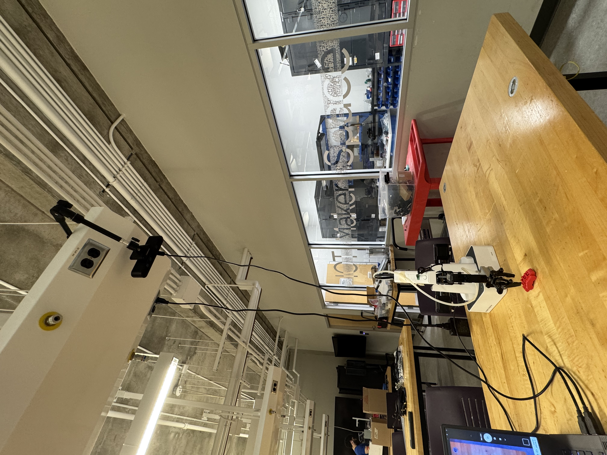
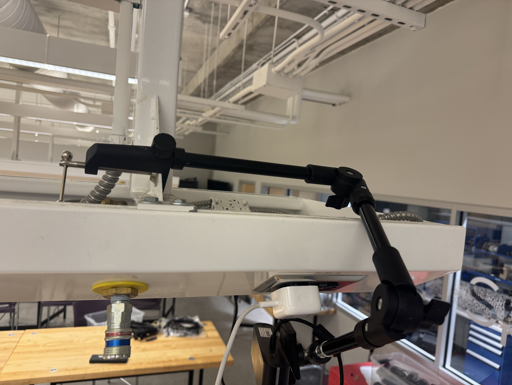
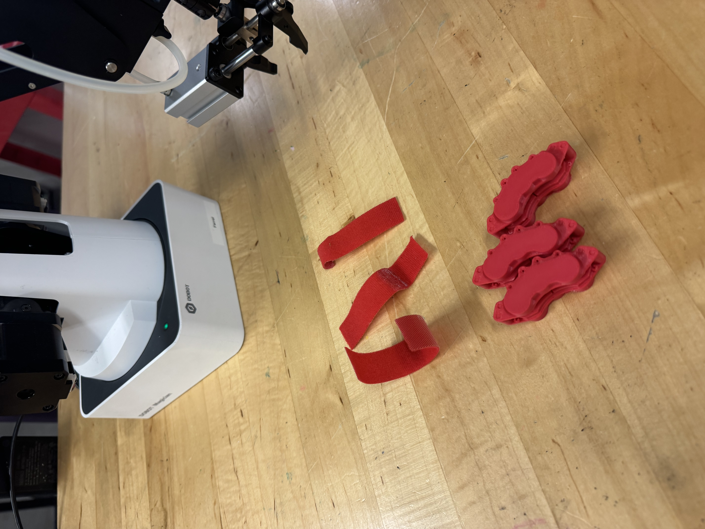

# Collaborative Robotic Arm 
## Challenge Overview
Robotics are growing increasingly common in manufacturing/warehouse settings to assist humans with various tasks. Traditionally, robots are in cages where human workers must stay out of during their operation. Toyota would like to take an innovative approach, where production workers and robots collaborate to achieve productivity boosts on their factory floor. This means that the robot and the human worker will be working on the same task but handling different parts of the task. 

You are tasked with designing the control of a desktop robotic arm that resembles a scaled-down version of a high torque arm found in TMMC, to work along with humans to achieve automative assembly tasks. Engineers at TMMC have already enabled the robot arm to complete a pick-and-place motion according to human actions. Your role is to continue developing this function to achieve more robot collaboration capabilities. The robot should consider efficiency, the safety of users around it, as well as the comfort of the users who interact with the robots.  

## Potential Solutions: 
- **Vision/Perception**: improve the current computer vision to achieve the detection of the car parts
- **Human-machine interface**: add in functions to detect worker's hand motions and steer robot away
- **Machine Controls**: improvement for robotic arm to accurately pick up car parts and place it in the corresponding box
- **Friendly Robots**: how should the robot behave to feel like a companion to workers instead of replacement
- **More areas to discover**: what do you think the current robotic arm should accomplish to collaborate human worke

## Recommend Roadmap: 

The following directions can be a starting direction for your development. You are not just limited to these directives; feel free to create something that has not been mentioned in the following.

**Milestones:**
1. Make velcros visible to to robot
Suggested Development: Modify pickCVBlock.py parameters such that the camera can see the red velcros on the table
hints: 
- check out `phase_detect_targets()` function. Don't be afraid to use AI tools to explain the function!
- velcros are smaller in camera fov in the challenge setup we provide
- lighting can affect how red the valcros appear to the camera

2. Velcro pick&place with robot arm 
Suggested Development: Pick up Velcro using the robotic arm and drop it off to a designated location
- run the pickCVBlock.py, adjust the control algorithm for a smooth robotic motion

3. Pick up 3D printed car part (Red Brake Caliper) using the robotic arm
Suggested Developent: improve the vision detection for velcro tags so it is robust against the brake caliper's irregular shape
- be aware the car parts might not be in the same color as the velcros!
- consider: how should the gripper grip the calipers to be able to pick them up

4. Detect a human hand in the camera frame
Suggested Development: Modify the computer vision program to send an alert when a human hand is in frame
- approaches can include basic color detection, movement tracking, or object detection

5. Avoid a human hand while picking up the part (Red Brake Caliper)
Suggested Development: think about how should the robot arm react to prevent collision with the human user. Is it stopping? Is it steering away? Is it something else?
- determine how should the robot arm should be moving or controlled
- determine if you should send a notification to the humans

 

 ---

## Starter Material Introduction:
Each team will be provided with the following equipment: 
1. A Dobot Magician arm with a gripper at the tip
2. A Orbbec camera
3. Camera Stand to mount camera
The image below shows an example setup of the camera and the robot arm. This setup allows the camera to see the robot arm's location as well as the table. You can modify this setup according to your design needs.

Setup: 



Clipping Camera Stand:



Each team will also be provided with 3 red tags to run the starter code. Teams can also request for 3 printed car parts as a part of their development.



# Introduction to Starter Source Code
The code provided for you in this folder is intented to help you get started on the development. It contains a working pick-place script for the robot arm that takes in vision from the camera and uses a state machine for control.


## Must Read Before Use: Robot Arm Set Up & Safety Training
Please read through the safety operation procedure in [here](https://github.com/IdeasClinicUWaterloo/S26-toyota-innovation-challenge/tree/docs/Collaborative_Robotics/Safety%20Instructions) before operating the provided robot arm. Failure to do so may result in damage to personal property or even injuries.

## Set up: (rerun this if you run into issues where the error is unable to connect to robot)
1. ensure all peripherals are plugged in: robot arm, camera
2. power up the arm by pressing the power button, wait for its calibration to coplete
3. launch DobotLab, click "connect" to the arm. After connecting, verify the COM port the robot is connected to
  - if asked to select an arm model: select "Dobot magician"
  [image here]
4. in dobotArm.py, ctrl+f to find `state = dType.ConnectDobot(api, "COM7", 115200)[0]`. Change the number after COM to reflect on the port you find
5. disconnect from DobotLab
5. if you every unplugged the robot arm, rerun the steps above the confirm the communication port is correct

## camera calibration
This script is needed for the camera to properly recognize where the red tags are located and connect the camera graphic to the robot's movement. 

Note: if you are using a different camera as provided in the challenge, you need to run `calibrateCamera.py`. This requires you to have a 4x4 ArUco board -> or any other similar calibration tool.

1. ensure camera is setup such that it can see the tabletop range the robot arm movement
2. run getTransformationMatrix.py
3. the robot will place its claw down to the table.You can place the red tag provided in between the gripper. try to ensure the centre of the strip is at the centre of the claw [show an image here]
4. press space as instructed by the program
5. the robot will move its claw away. now examine the camera graphic to ensure the tag is fully visible in the camera and not blocked by the arm. [image here]
6. press space again to continue. the robot will repeat step 3-5 for more points, continue until the scrip finishes running

## Robot Pick-Place Script
a basic script implementing a detect part/pick place function has been provided to you as a starter code.Check the code comments to see what it does. Feel free to base your solution off of this script, or feel free to created something new!


## Basic Robot Control
Refer to `testDobot.py` for basic Dobot control codes

**Notes**

- Do not modify the lib folder (unless you're sure of what you're doing) -> it includes the DLLs to interface with DobotLink
- dobotArm.py contains the python wrapper functions. Try to call from this library unless absolutely needed. Only modify the functions inside if you know what you are doing


### Using Intrinsic Calibration Data

You need to first import all the data

```python
data          = np.load("camera_params.npz")
camera_matrix = data["camera_matrix"]   # 3x3 intrinsic matrix  (K)
dist_coeffs   = data["dist_coeffs"]     # distortion vector
```

- Option A - undistort a single frame (simple):
  `undistorted = cv2.undistort(frame, camera_matrix, dist_coeffs)`

- Option B - fast per-frame using pre-computed maps (recommended for live video):

```python
h, w = frame.shape[:2]
new_K, roi = cv2.getOptimalNewCameraMatrix(camera_matrix, dist_coeffs, (w,h), alpha=1)
map1, map2 = cv2.initUndistortRectifyMap(camera_matrix, dist_coeffs,
                                              None, new_K, (w,h), cv2.CV_16SC2)
undistorted = cv2.remap(frame, map1, map2, cv2.INTER_LINEAR)
```

- Option C - pose estimation with solvePnP:
  `cv2.solvePnP(obj_pts, img_pts, camera_matrix, dist_coeffs)`


