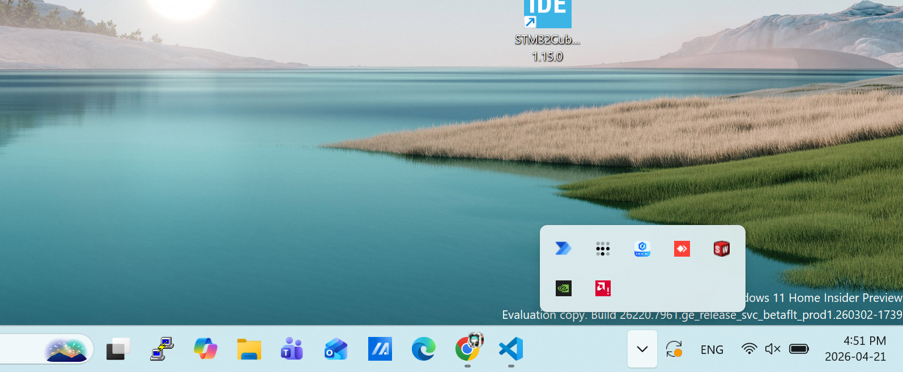

# Robot Arm Setup and Safety Training

This document outlines the safety procedures that must be followed while operating the robotic arm.

The arms do not come with any native sensing capabilities. Its movement entirely depends on the robot's motor encoder data. Hence, human monitoring is needed to ensure the robot does not reach its movement limits, and does not crash into items it is not intended to contact.

## Before Operation:
Dobot Magician arm is capable in moving in the following highlighted areas. Before powering on the robot, ensure this area is free of any obstacles, such as personal items. At the same time, ensure the electrical wiring and the pneumatic pump hose is secured so it does not block the robot's movement.

## Software Setup:
1. Download the [Dobot Link](https://www.dobot.us/download-center/) and [Dobot Lab](https://www.dobot.us/download-center/)
2. Follow the instruction in the download files. It it normal for windows to flash multiple times after clicking a button. 
    - For each "install" button you must click install and let the installation run 3 times for the software to fully install.

3. Lanch the two apps after installation: Dobot Link shoud appear as an icon in tray, and dobot lab should be directly launchable 

4. To launch dobotlink: pull up the application's icon in the tray, click and select "launch developer interface," then select "device test." In the connect row, select your robot arm and connect 

5. To launch dobotlab: launch the application, then select the tab with the Python logo. Click the conenct button on top of that interface 

## Robot Connect & Power Up:
1. press the button with a "lock" icon on the robot arm and move it to the approximate poste as shown here
 
 
2. connect the robot to your compuer by plugging in its USB cable

3. press the power button on the robot's base. The robot should power up, beep after waiting for a moment. Robot should being its initialization process bu conducting a sweep over its entire operation region.
4. Now you should be prepared to run your script! Check back in the main folder for how to run the given source code

## Robot Power Down
Note: when robot is diconencted from power, its motors will no longer hold the robot in position, meaning the arm will instantly crash to the ground at shutdown. Following the procedures below prevents damage to the arm.
1. place your hand near the robot arm to prepare for catching the falling arm
2. IF conducting regular shutdown by pressing the metal power button: robot should have a shutdown sequence by moving back to a safe postiion before cutting power. Be prepared to catch the arm if this did not happen.
3. IF conducting emergency shutdown by power cable pull: place your hand under the arm to catch the falling arm, or hold down the unlock button while pulling the cable

## Running Scripts on Robot
Everytime a script is ran, the robot will compete an initialization again by sweeping over its entire reagion of operation. Ensure your setup does not interfere with the robot's movement during the setup

## Common Protocols for Robot Malfunction (Please be prepared to perform any of the steps below as soon as trouble starts)
### Locate the Following Emergency Switch Locations
1. Main Power Cable: located at the back fo the robot base 

2. Booting Switch: metallic press button located at the top of the robots base 

3. Robot Joint Unlocking Switch: Located near the robot gripper. A plastic press button with a lock symbol on it.
 

4. Robot Status Light: located at top of the robot's base. 
    - How to read: Green light = normal operation, yellow light: setup in progress, red light = trouble flagged
### Common Failure Scenario
TL,DR: if robot begin to move with unexpected or potentially dangerous behavior, hold down the unlocking button and pull the power cable. 

| Scenario | Symptoms | Resolution |
| -------- | -------- | -------- |
| Robot gets caught in a limit position or a physical obstacle    | Robot makes a clicking movement sound     |  Hold down the join unlocking swtich and hold the arm, and power off the main switch. Restart robot connect and power up steps |
| Robot's Status Light turns red    | Robot does not respond to any programs   |  1. Connect robot through dobot lab 2. Click on the sweep icon to clear warnings 3. Disconnect robot arm from dobot lab|
 
## Congrats on getting through the safety training! You can now proceed to using the source code.

   
